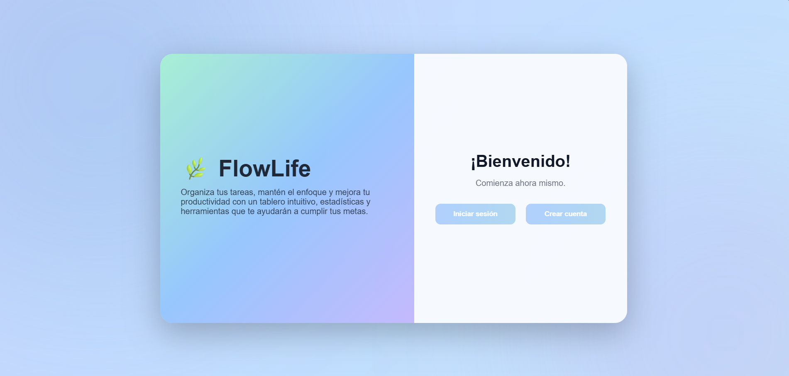
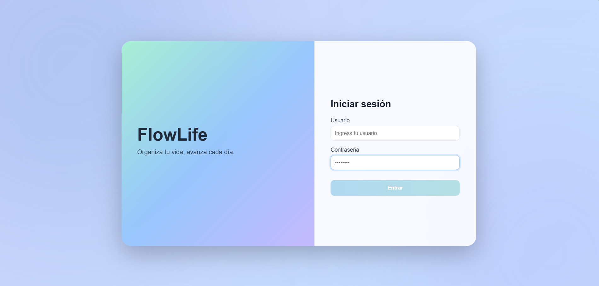
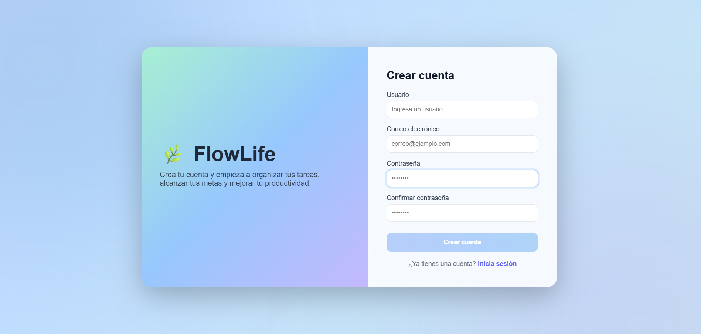
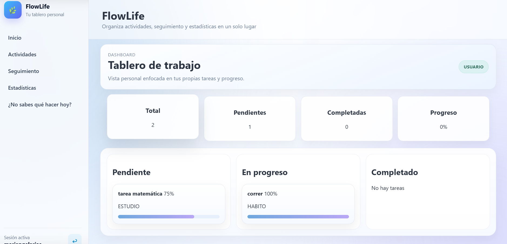
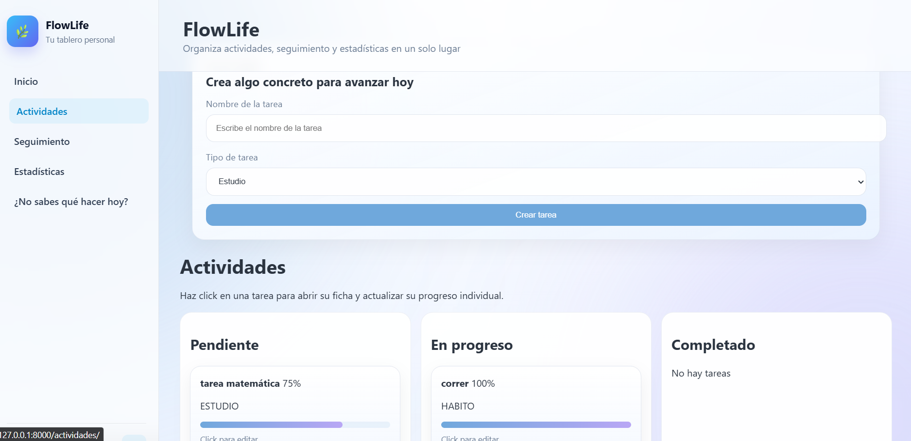
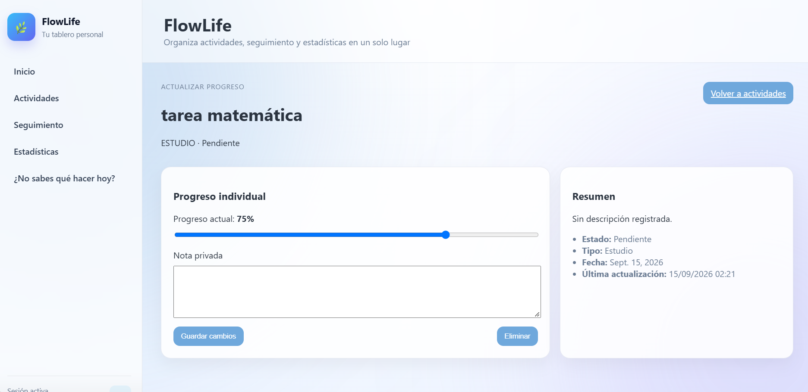
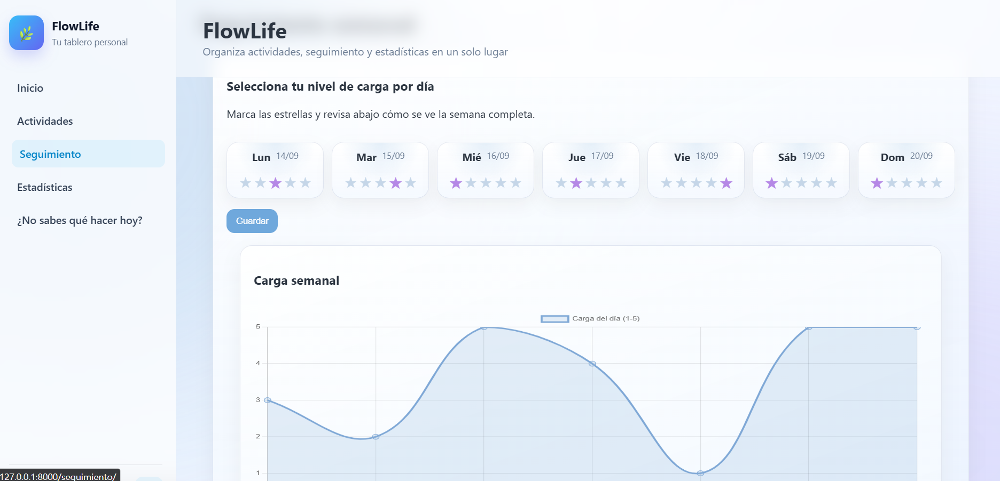
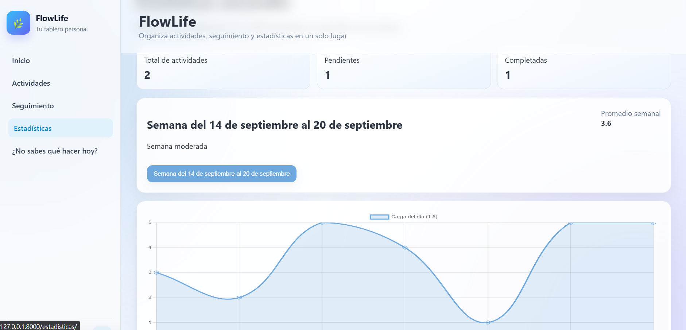
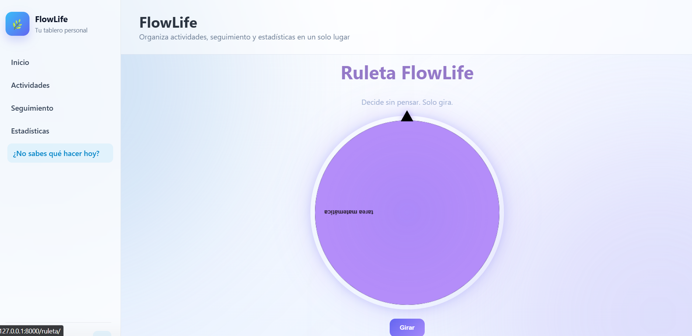
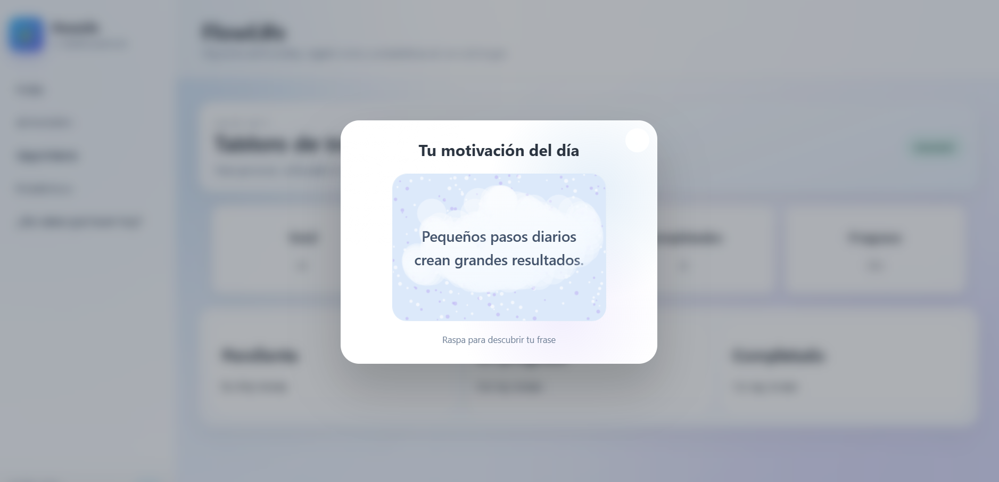

# FlowLife

**FlowLife** es una aplicación web desarrollada con Django para la gestión de actividades personales, académicas y de trabajo. El sistema combina un tablero interactivo de actividades con herramientas de seguimiento del progreso, estado de ánimo y estadísticas semanales.

El proyecto busca centralizar la organización de actividades y proporcionar al usuario una visión sencilla de su progreso y desempeño durante la semana.

## Funcionalidades

* Registro e inicio de sesión de usuarios.
* Tablero interactivo para organizar actividades según su estado.
* Funcionalidad **Drag & Drop** para mover actividades entre las diferentes columnas del tablero.
* Clasificación de actividades por categoría y tipo.
* Creación, edición y eliminación de actividades.
* Estados de actividad: pendiente, en progreso y completada.
* Seguimiento del progreso de las actividades.
* Registro del estado de ánimo.
* Registro de la carga diaria.
* Estadísticas semanales mediante gráficos.
* Vista detallada de las actividades.
* Ruleta para seleccionar actividades.
* Raspa diaria como elemento interactivo de gamificación.
* Vista de solo lectura para administradores sobre las actividades de los usuarios.

## Capturas del sistema

### Página de inicio

La página principal presenta el propósito de FlowLife y permite acceder a las opciones de autenticación.



### Inicio de sesión

Los usuarios pueden acceder al sistema mediante sus credenciales.



### Registro de usuario

Los nuevos usuarios pueden crear una cuenta para utilizar las funcionalidades de FlowLife.



### Panel principal

El dashboard permite visualizar y administrar las actividades del usuario desde un único espacio.



### Creación de actividades

El sistema permite registrar nuevas actividades indicando información como título, descripción, tipo, categoría y fecha.



### Progreso de actividades

La parte de edición de actividades en FlowLife permite al usuario modificar la información de una actividad que ya fue creada, sin necesidad de eliminarla y registrarla nuevamente.



### Seguimiento

La sección de seguimiento permite registrar información diaria relacionada con el estado de ánimo, la carga y el progreso de las actividades.



### Estadísticas

FlowLife presenta estadísticas semanales mediante gráficos que permiten visualizar el progreso y comportamiento de las actividades.



### Ruleta

La ruleta permite seleccionar de forma interactiva una actividad, incorporando un elemento dinámico a la organización de tareas.



### Raspa diaria

FlowLife incorpora una dinámica interactiva diaria mediante una tarjeta para raspar y descubrir una recompensa.



## Tecnologías utilizadas

* **Python**
* **Django**
* **MySQL**
* **HTML5**
* **CSS3**
* **JavaScript**
* **Chart.js**
* **Git y GitHub**

## Requisitos

Antes de instalar el proyecto se recomienda contar con:

* Python 3.11 o superior.
* MySQL.
* Git.
* `pip`.
* Un navegador web moderno.

Las dependencias de Python utilizadas por el proyecto se encuentran en `requirements.txt`.

## Instalación

### 1. Clonar el repositorio

```bash
git clone https://github.com/MariangelArias/flowlife.git
cd flowlife
```

### 2. Crear un entorno virtual

En Windows:

```bash
python -m venv env
```

### 3. Activar el entorno virtual

En PowerShell:

```powershell
.\env\Scripts\Activate.ps1
```

En CMD:

```cmd
env\Scripts\activate
```

Una vez activado, el nombre del entorno aparecerá al inicio de la terminal:

```text
(env) PS C:\Users\...\flowlife>
```

### 4. Instalar las dependencias

```bash
pip install -r requirements.txt
```

### 5. Configurar las variables de entorno

Crear un archivo `.env` en la raíz del proyecto tomando como referencia `.env.example`.

Ejemplo:

```env
DJANGO_SECRET_KEY=tu_clave_secreta
DJANGO_DEBUG=True
DJANGO_ALLOWED_HOSTS=127.0.0.1,localhost

DJANGO_DB_ENGINE=django.db.backends.mysql
DJANGO_DB_NAME=flowlife
DJANGO_DB_USER=tu_usuario
DJANGO_DB_PASSWORD=tu_contraseña
DJANGO_DB_HOST=localhost
DJANGO_DB_PORT=3306
```

Los valores deben adaptarse a la configuración local de cada entorno.

### 6. Crear la base de datos

Crear previamente la base de datos `flowlife` en MySQL.

Por ejemplo:

```sql
CREATE DATABASE flowlife;
```

### 7. Ejecutar las migraciones

```bash
python manage.py migrate
```

### 8. Crear un usuario administrador

Para crear un usuario con permisos administrativos:

```bash
python manage.py createsuperuser
```

Seguir las instrucciones mostradas en la terminal para establecer el nombre de usuario, correo electrónico y contraseña.

### 9. Ejecutar el servidor

```bash
python manage.py runserver
```

Luego abrir en el navegador:

```text
http://127.0.0.1:8000/
```

## Variables de entorno

FlowLife utiliza variables de entorno para separar la configuración del proyecto de los valores específicos de cada instalación.

| Variable               | Descripción                              |
| ---------------------- | ---------------------------------------- |
| `DJANGO_SECRET_KEY`    | Clave secreta utilizada por Django       |
| `DJANGO_DEBUG`         | Activa o desactiva el modo de depuración |
| `DJANGO_ALLOWED_HOSTS` | Hosts permitidos por Django              |
| `DJANGO_DB_ENGINE`     | Motor utilizado para la base de datos    |
| `DJANGO_DB_NAME`       | Nombre de la base de datos               |
| `DJANGO_DB_USER`       | Usuario de la base de datos              |
| `DJANGO_DB_PASSWORD`   | Contraseña de la base de datos           |
| `DJANGO_DB_HOST`       | Servidor donde se encuentra MySQL        |
| `DJANGO_DB_PORT`       | Puerto utilizado por MySQL               |

## Roles de usuario

FlowLife contempla diferentes niveles de acceso.

### Usuario

El usuario puede:

* Crear y administrar sus actividades.
* Organizar actividades según su estado.
* Consultar su progreso.
* Registrar su estado de ánimo.
* Registrar la carga diaria.
* Consultar sus estadísticas.
* Utilizar las funcionalidades interactivas del sistema.

### Administrador

El administrador cuenta con una vista global para consultar información sobre las actividades registradas por los usuarios.

La vista administrativa está orientada a la supervisión y consulta de información.

## Organización de las actividades

Las actividades se gestionan mediante un tablero visual dividido según su estado:

- **Pendiente**
- **En progreso**
- **Completada**

El tablero incorpora funcionalidad **Drag & Drop**, permitiendo al usuario mover una actividad de una columna a otra de manera interactiva. Al realizar el movimiento, el sistema actualiza el estado correspondiente de la actividad.

Las actividades también pueden clasificarse según diferentes tipos:

- **Estudio**
- **Hábito**
- **Trabajo**
- **Evento**

## Seguimiento y estadísticas

FlowLife incorpora herramientas para analizar el progreso del usuario durante la semana.

El sistema permite registrar información relacionada con:

* Progreso de actividades.
* Estado de ánimo.
* Carga diaria.
* Actividades completadas.
* Evolución semanal.

Los datos registrados se presentan mediante gráficos para facilitar su interpretación.

## Estructura del proyecto

De forma general, el proyecto se organiza de la siguiente manera:

```text
flowlife/
│
├── config/
│   ├── settings.py
│   ├── urls.py
│   └── ...
│
├── core/
│   ├── migrations/
│   ├── templates/
│   │   └── core/
│   ├── static/
│   ├── admin.py
│   ├── models.py
│   ├── urls.py
│   └── views.py
│
├── docs/
│   └── images/
│       ├── landing.png
│       ├── login.png
│       ├── register.png
│       ├── dashboard.png
│       ├── crear-actividad.png
│       ├── seguimiento.png
│       ├── estadisticas.png
│       ├── ruleta.png
│       └── raspa.png
│
├── manage.py
├── requirements.txt
├── .env.example
└── README.md
```

## Seguridad

Para evitar exponer información sensible:

* No subir archivos `.env` al repositorio.
* No almacenar contraseñas directamente en el código fuente.
* No subir bases de datos locales que contengan información sensible.
* Mantener las claves secretas fuera del control de versiones.
* Utilizar `.env.example` para documentar las variables necesarias sin incluir valores reales.
* Mantener las credenciales de la base de datos fuera del repositorio.

## Desarrollo

Para trabajar con el proyecto localmente, se recomienda activar el entorno virtual antes de ejecutar comandos relacionados con Django.

```powershell
.\env\Scripts\Activate.ps1
```

Para comprobar que Django está correctamente configurado:

```bash
python manage.py check
```

Para iniciar el servidor:

```bash
python manage.py runserver
```

## Estado del proyecto

Este proyecto se encuentra actualmente en desarrollo activo. Algunas funcionalidades pueden estar incompletas, sujetas a cambios o presentar ajustes menores mientras se continúa trabajando en mejoras y nuevas características.

